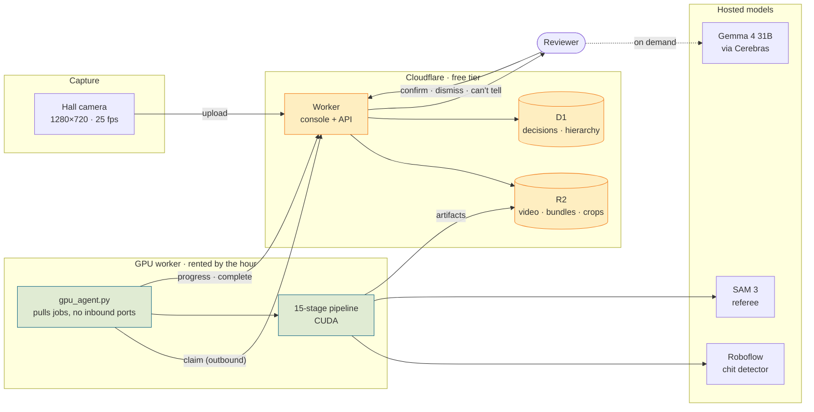
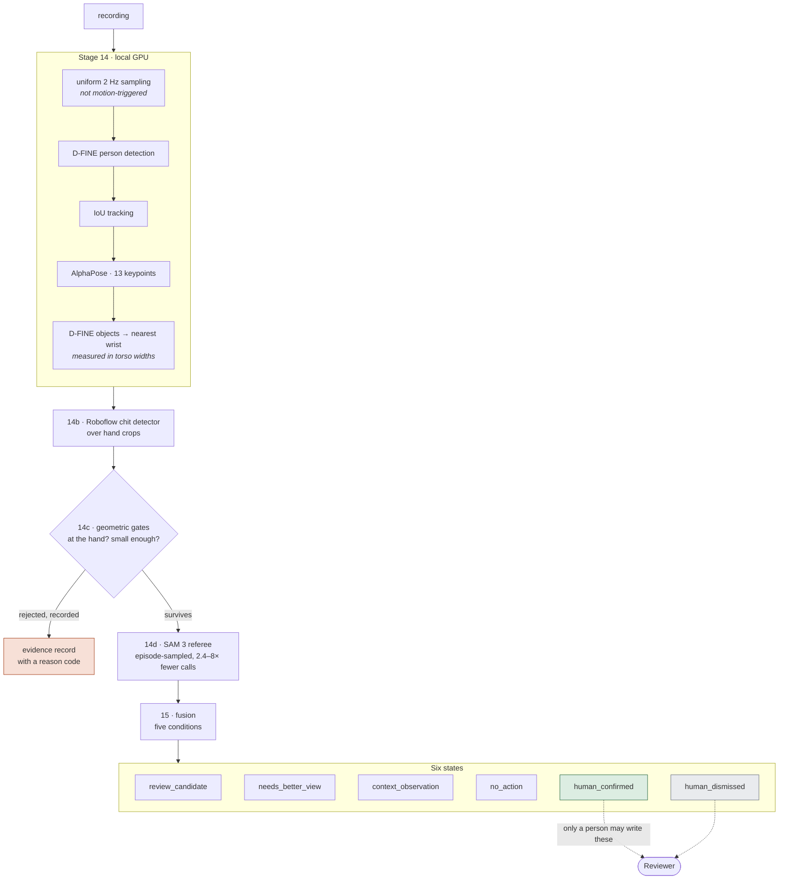
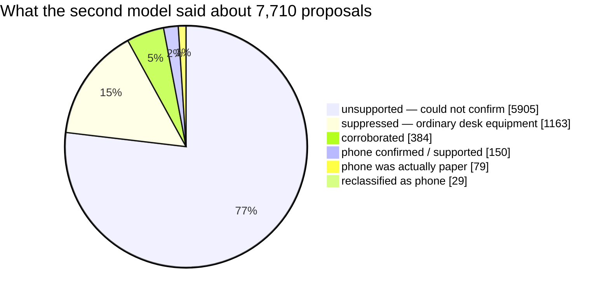
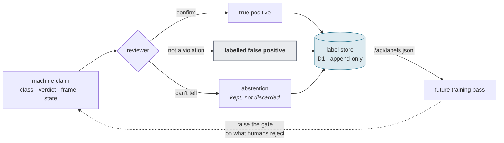

<div align="center">

# Drishti · Project Classroom

**CCTV review for computer-based exam centres.**
It finds moments worth a human's attention. It never decides that anyone cheated.

[](docs/OUTPUT_CONTRACT.md)
[](docs/OUTPUT_CONTRACT.md)
[](tests/)
[](https://drishti-console.drishti-console.workers.dev)

</div>

---

## The one-paragraph version

A hall of 200 candidates on computers, one ceiling camera, and a proctor who
cannot watch everyone. This system watches the recording, tracks every person,
and asks one narrow question per person: *was something held near their hands
that is not ordinary desk equipment?* When two independent models agree, it puts
one frame in front of a human and asks them to decide. When it cannot tell — and
on this corpus it usually cannot — **it says so, loudly, instead of guessing.**

Of 593 people tracked across five recordings, it routed **6** to review and
abstained on **567**. That 96% abstention rate is the headline, not a gap to
read past.

---

## Why abstention is the design, not a failure

Every proctoring system faces the same asymmetry:

|  | Cost |
| --- | --- |
| Missing a cheat | one candidate gains an unfair advantage |
| Falsely accusing a candidate | a person's exam, and possibly their year, is destroyed on the word of a model that saw 40 blurry pixels |

These are not symmetric, so the system is not tuned symmetrically. Four rules
are enforced in code, not by convention:

1. **No raw count is ever presented as a cheating rate.**
2. **Nobody is ever ranked by number of detections.**
3. **Abstentions are never hidden.** "Could not tell" is a first-class output with its own state.
4. **No probability of cheating is ever emitted.** The system has no such quantity.

`pipeline/fusion.py` raises if code tries to write `human_confirmed` or
`human_dismissed` — those two states may only come from a person clicking a
button. That is the whole architecture in one assertion.

---

## Architecture



**The GPU pulls; nothing pushes to it.** Every arrow out of the GPU box is
outbound HTTPS, so there is no port to forward, no static IP and no tunnel to
keep alive. A machine behind a campus NAT — or a cloud instance that exists for
forty minutes — runs this unchanged.

---

## The pipeline



**Detectors propose. SAM 3 verifies. Neither judges.**

Records are never deleted, only annotated. A rejected detection keeps its
reason code, which is what makes precision and recall computable later —
once ground truth exists.

### The five fusion conditions

Each is a yes/no question with its arithmetic attached, shown to the reviewer
on demand:

| Condition | The question a reviewer reads |
| --- | --- |
| `proposal_survives_geometry` | Was the object at their hand, and small enough? |
| `sam3_supports_or_cannot_exclude` | Did the second model back it up? |
| `associated_with_this_person` | Was it this person's, not a neighbour's? |
| `lasts_or_recurs` | Did it last, or keep happening? |
| `no_dominant_equipment_explanation` | Ruled out ordinary desk equipment? |

---

## What was actually measured

Everything below is counted from committed run artifacts. Nothing here is an
accuracy claim — see [the honest limits](#the-honest-limits).

### The funnel, five recordings, 10m 55s of footage

| Recording | Tracked | → review | abstained | context |
| --- | ---: | ---: | ---: | ---: |
| Hall 3 · paper handling | 236 | 3 | 217 | 16 |
| Hall 4 · mobile usage | 167 | 1 | 166 | 0 |
| Hall 5 · talking | 92 | 0 | 90 | 2 |
| Hall 1 · phone | 84 | 2 | 80 | 2 |
| Hall 6 · phone (10s clip) | 14 | 0 | 14 | 0 |
| **Total** | **593** | **6** | **567** | **20** |

### SAM 3 as referee — 7,710 adjudications



Two numbers matter here:

- **15.1% suppressed as desk equipment.** The referee is doing real work
  killing keyboards, mice and monitors that the detector proposed as objects
  of interest. Those are the hard negatives.
- **5.4% backed the object claim.** The rest is the system refusing to
  confirm, which routes to `needs_better_view` — *not confirmed*, never
  *absent*.

`unsupported` means **not confirmed**. It does not mean nothing was there.
SAM 3 missed known true positives on this corpus, which is exactly why it can
suppress a candidate but can never clear one.

### The honest limits

> **There is no accuracy figure for this system, and this README will not
> invent one.**

Watching the footage by eye, the impression is that the detectors surface
nearly every genuine incident and bury it in false positives. That impression
is consistent with the 96% abstention rate and the 76.6% `unsupported` share —
but **an impression is not a benchmark**, and reporting it as one would be the
exact failure the output contract exists to prevent.

What is missing to turn it into a real number:

- [ ] Frame-level ground truth on the corpus, labelled by someone who is not the author
- [ ] A held-out split the thresholds were never tuned against
- [ ] Precision/recall computed per lane, with the abstentions counted honestly rather than dropped
- [ ] Inter-rater agreement between two human reviewers on the same clips

Until those exist, the deliverable is a **queue ordered by evidence**, not a
detector with a score. Every record needed to compute those metrics is already
being written — that is what the reason codes are for.

---

## Learning from the reviewer

Every decision is stored append-only. A reviewer who changes their mind writes
a second row; the first stays, because *confirmed then dismissed* is a more
informative example than either answer alone.



**The dismissals are the valuable half.** A detection nobody disputes teaches
little. A detection the machine made, a human overturned, and which still
carries the machine's original claim — class, SAM 3 verdict, frame, confidence
— is a labelled hard negative, and hard negatives are what a 76.6%
`unsupported` rate needs.

To be precise about the method: this is **supervised learning from human
feedback on a fixed corpus**, not reinforcement learning. There is no policy
taking actions in an environment and no reward signal being optimised online.
Calling it RL would oversell it. The realistic first pass is re-tuning the
geometric gates and the SAM 3 prompt against the accumulated labels, then
fine-tuning the chit detector on the confirmed/dismissed crops.

Export the whole label set, reversals included:

```bash
curl https://drishti-console.drishti-console.workers.dev/api/labels.jsonl
```

---

## The console

One person, one screen, one decision.

| Screen | What it is for |
| --- | --- |
| **Overview** | the run at a glance, and uploading a recording |
| **Review** | one candidate at a time — picture first, three keys, auto-advance |
| **Video** | wipe player, findings table, per-person isolation |
| **Not violations** | the labelled false-positive set, exportable |

**Review keys:** `1` confirm · `2` not a violation · `3` can't tell · `w` show
the reasoning · `g` ask Gemma · `n`/`p` next and previous.

Three things it deliberately does:

- **Shows the picture before the reasoning.** The arithmetic is folded away,
  because the working is what you check *after* the image surprises you.
- **On a SAM-supported frame, draws only the supported box.** The other
  proposals are equipment context and drawing them buries the one box the
  reviewer is being asked about.
- **Names people `Person #118 · unattributed`.** Seat calibration is
  unapproved on every profile but one, so the console never implies that
  `#118` means seat 118.

### Looking away is a separate condition

Measured on its own criteria — a turn held ≥3s, or ≥4 turns inside 20s —
against **that person's own baseline**, and it can never route someone to
review by itself. Head direction is four-way and coarse. **It is not gaze**,
and gaze is not recoverable at this source scale.

---

## What we tried, and what we rejected

| Tried | Outcome |
| --- | --- |
| Motion-triggered sampling (run 1446) | **Rejected.** Looked at 20–39% of each recording; a candidate who sits still was never observed. Replaced by uniform sampling. |
| Ranking review frames by detector confidence | **Rejected.** Put a 0.90 shirt above a 0.55 verified phone. Ranking is now by SAM 3's verdict first. |
| Corroboration as a fixed count (≥3 frames) | **Replaced by count OR rate.** A pure 2/3 rate deleted all three true positives on the paper run — track 118 was 5 of 19 frames (26%). |
| Blend slider for the annotated overlay | **Rejected.** At 50% opacity you cannot tell our box from the desk bezel. Replaced by a hard wipe. |
| Showing Gemma the annotated crop | **Rejected.** It described our own drawn rectangle back as "a small, orange-bordered rectangular object". It now gets the clean crop. |
| 16-way concurrency on the Roboflow calls | **Rejected.** Lost 2,937 of 3,439 calls to rate limiting. Held at ~6. |
| COCO `cell phone` routing to review | **Rejected.** It is workstation context only. The phone route runs through SAM 3 naming it. |
| Drawing all 236 tracked people on the video | **Rejected.** Identical picture whether a run found one thing or nothing. Now draws only people with findings. |

Several of these were caught only by rendering the output and looking at it.
That is the working method: **render before believing counts.**

---

## Running it

### Locally

```bash
cd console
npm install
npm run dev          # API on :5179, console on :5178
```

SQLite by default. The server prints the database path it opened — a mistyped
`DRISHTI_DB` otherwise opens a different, empty database, and an empty project
list is indistinguishable from "nobody has created anything yet".

### The GPU worker

```bash
export DRISHTI_CONSOLE=https://drishti-console.drishti-console.workers.dev
export ROBOFLOW_API_KEY=<key>
python -c "import torch; print(torch.cuda.is_available())"   # do not skip
python tools/gpu_agent.py --once
```

Always `--once` first: one job, so a wiring mistake surfaces on one recording
rather than on the whole queue.

Full deployment runbook: **[docs/DEPLOYMENT.md](docs/DEPLOYMENT.md)**

---

## Repository map

| Path | What lives there |
| --- | --- |
| `pipeline/` | the stages, the reason codes, the fusion policy machine |
| `tools/` | run drivers, bundlers, the GPU agent |
| `console/src/` | React review console |
| `console/server/` | Node API — SQLite or Postgres |
| `console/worker/` | the same API on Cloudflare — D1 and R2 |
| `docs/OUTPUT_CONTRACT.md` | **frozen v1.0.0.** Read before changing what this reports |
| `tests/` | 63 tests, 27 of them contract invariants |

`console/server/routes.js` is shared by the Node server and the Worker.
Two copies would drift, and the first thing to drift would be the decision
vocabulary — the one part that must not.

---

## Status

**Working:** the 15-stage pipeline on GPU · the review console · decisions
persisted append-only · upload → job → GPU → artifacts → console, verified end
to end · deployed on Cloudflare with D1 and R2.

**Not done:** no authentication on the console or the job queue · no evaluation
pack, so no accuracy figure · no job timeout, so a dead agent leaves a job
`claimed` · seat attribution unapproved on all but one calibration profile ·
stages 14b and 14d are online, which conflicts with an offline requirement, and
that is stated wherever their results are reported.

---

<div align="center">
<sub>Detectors propose · SAM 3 verifies · neither judges</sub>
</div>
